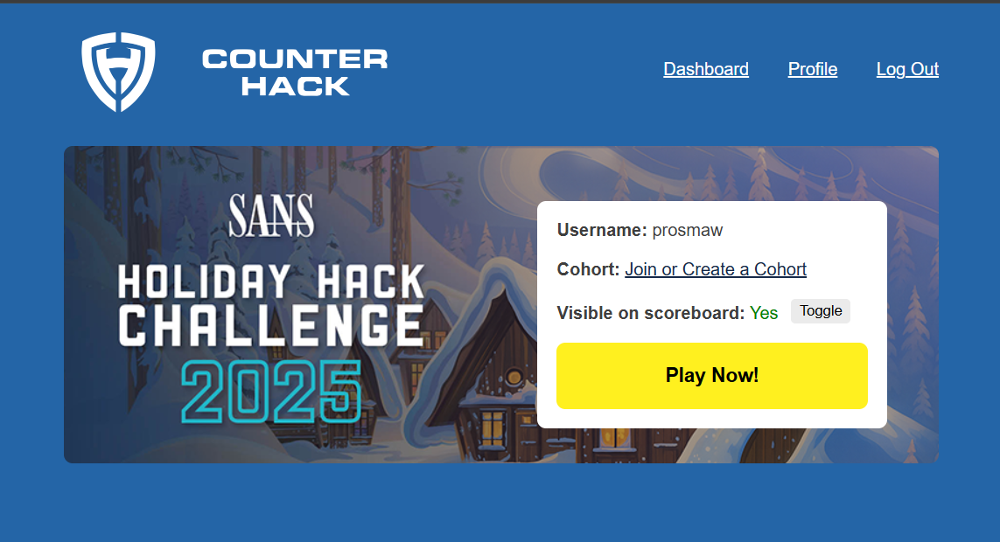
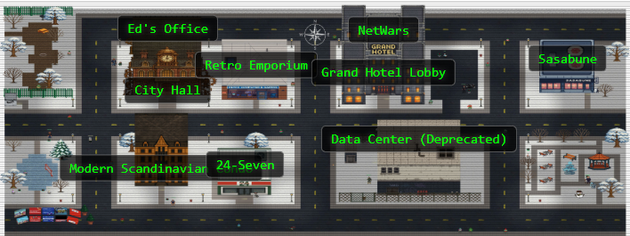

# Welcome

## Introduction

The SANS Holiday Hack Challenge 2025 dropped participants into a winter town taken over by gnomes. The gnomes were breaking things across city hall, the hotel, the park, and the retro shop. The challenge covers multi-domain CTF on a total of 27 objectives and five difficulty tiers.

I worked on 21 objective covering a wide range of discipline: hunting leaked SAS (Shared Access Signature) tokenand misconfigured Azure Storage accounts, exploiting IDOR (Insecure Direct Object Reference) vulnerabilities, cracking IMAP configurations, reverse engineering binaries, and performing RCE with privilege escalation. 

### Story

ACT I

The Counter Hack crew is in the Neighborhood festively preparing for the holidays when they are suddenly overrun by lively Gnomes in Your Home! There must have been some magic in those Gnomes, because, due to some unseen spark, some haunting hocus pocus, they have come to life and are now scurrying around the Neighborhood.

ACT II

The Gnomes’ nefarious plot seems to involve stealing refrigerator parts. But why?

ACT III

The Gnomes want to transform the neighborhood so that it’s frozen solid year-round, an environmental disaster. But who is the mastermind behind the Gnomes’ wickedness?

### Map

??? tip "Navigation tip"
    Even with less than 50 pages, there's still quite a bit of information to read through. To make things a little easier, you can use ++"P"++ or ++","++ to go to the previous section, ++"N"++ or ++"."++ to navigate to the next section, and ++"S"++, ++"F"++, or ++"/"++ to open up the search dialog.

    **TL;DR** if you keep pressing ++"N"++ or ++"."++ from this point forward, you'll hit all the content in the right order! :smile:

## Answers

## Act I

!!! success "1. Its All About Defang - :fontawesome-solid-star::fontawesome-regular-star::fontawesome-regular-star::fontawesome-regular-star::fontawesome-regular-star:"
    [Write-up](./objectives/o1.md)

!!! success "2. Neighborhood Watch Bypass - :fontawesome-solid-star::fontawesome-regular-star::fontawesome-regular-star::fontawesome-regular-star::fontawesome-regular-star:"
    [Write-up](./objectives/o2.md)

!!! success "3. Santa's Gift-Tracking Service Port - :fontawesome-solid-star::fontawesome-regular-star::fontawesome-regular-star::fontawesome-regular-star::fontawesome-regular-star:"
    [Write-up](./objectives/o3.md)

!!! success "4. Visual Networking Thinger - :fontawesome-solid-star::fontawesome-regular-star::fontawesome-regular-star::fontawesome-regular-star::fontawesome-regular-star:"
    [Write-up](./objectives/o4.md)

!!! success "5. Visual Firewall Thinger - :fontawesome-solid-star::fontawesome-regular-star::fontawesome-regular-star::fontawesome-regular-star::fontawesome-regular-star:"
    [Write-up](./objectives/o5.md)

!!! success "6. Intro to Nmap - :fontawesome-solid-star::fontawesome-regular-star::fontawesome-regular-star::fontawesome-regular-star::fontawesome-regular-star:"
    [Write-up](./objectives/o6.md)

!!! success "7. Blob Storage Challenge in the neighborhood - :fontawesome-solid-star::fontawesome-regular-star::fontawesome-regular-star::fontawesome-regular-star::fontawesome-regular-star:"
    [Write-up](./objectives/o7.md)

!!! success "8. Spare Key - :fontawesome-solid-star::fontawesome-regular-star::fontawesome-regular-star::fontawesome-regular-star::fontawesome-regular-star:"
    [Write-up](./objectives/o8.md)

!!! success "9. The Open Door - :fontawesome-solid-star::fontawesome-regular-star::fontawesome-regular-star::fontawesome-regular-star::fontawesome-regular-star:"
    [Write-up](./objectives/o9.md)

!!! success "10. Owner - :fontawesome-solid-star::fontawesome-regular-star::fontawesome-regular-star::fontawesome-regular-star::fontawesome-regular-star:"
    [Write-up](./objectives/o10.md)

## Act II

!!! success "11. Retro Recovery - :fontawesome-solid-star::fontawesome-solid-star::fontawesome-regular-star::fontawesome-regular-star::fontawesome-regular-star:"
    [Write-up](./objectives/o11.md)

!!! success "12. Mail Detective - :fontawesome-solid-star::fontawesome-solid-star::fontawesome-regular-star::fontawesome-regular-star::fontawesome-regular-star:"
    [Write-up](./objectives/o12.md)

!!! success "13. IDORable Bistro - :fontawesome-solid-star::fontawesome-solid-star::fontawesome-regular-star::fontawesome-regular-star::fontawesome-regular-star:"
    [Write-up](./objectives/o13.md)

!!! success "14. Dosis Network Down - :fontawesome-solid-star::fontawesome-solid-star::fontawesome-regular-star::fontawesome-regular-star::fontawesome-regular-star:"
    [Write-up](./objectives/o14.md)

!!! success "15. Insert Objective 2 Title - :fontawesome-solid-star::fontawesome-solid-star::fontawesome-regular-star::fontawesome-regular-star::fontawesome-regular-star:"
    [Write-up](./objectives/o15.md)

!!! success "16. Quantgnome Leap - :fontawesome-solid-star::fontawesome-solid-star::fontawesome-regular-star::fontawesome-regular-star::fontawesome-regular-star:"
    [Write-up](./objectives/o16.md)

!!! success "17. Going in Reverse - :fontawesome-solid-star::fontawesome-solid-star::fontawesome-regular-star::fontawesome-regular-star::fontawesome-regular-star:"
    [Write-up](./objectives/o17.md)

!!! success "19. Insert Objective 2 Title - :fontawesome-solid-star::fontawesome-solid-star::fontawesome-regular-star::fontawesome-regular-star::fontawesome-regular-star:"
    [Write-up](./objectives/o19.md)

!!! success "22. Insert Objective 2 Title - :fontawesome-solid-star::fontawesome-solid-star::fontawesome-regular-star::fontawesome-regular-star::fontawesome-regular-star:"
    [Write-up](./objectives/o22.md)

!!! success "24. Insert Objective 2 Title - :fontawesome-solid-star::fontawesome-solid-star::fontawesome-regular-star::fontawesome-regular-star::fontawesome-regular-star:"
    [Write-up](./objectives/o24.md)

## Act III

!!! success "18. Gnome Tea - :fontawesome-solid-star::fontawesome-solid-star::fontawesome-solid-star::fontawesome-regular-star::fontawesome-regular-star:"
    [Write-up](./objectives/o18.md)

!!! success "20. Snowcat RCE & Priv Esc - :fontawesome-solid-star::fontawesome-solid-star::fontawesome-solid-star::fontawesome-regular-star::fontawesome-regular-star:"
    [Write-up](./objectives/o20.md)

!!! success "21. Schrödinger's Scope - :fontawesome-solid-star::fontawesome-solid-star::fontawesome-solid-star::fontawesome-regular-star::fontawesome-regular-star:"
    [Write-up](./objectives/o21.md)

!!! success "23. On the Wire - :fontawesome-solid-star::fontawesome-solid-star::fontawesome-solid-star::fontawesome-solid-star::fontawesome-regular-star:"
    [Write-up](./objectives/o23.md)
