# Its All About Defang

**Difficulty**: :fontawesome-solid-star::fontawesome-regular-star::fontawesome-regular-star::fontawesome-regular-star::fontawesome-regular-star:<br/>
**Direct link**: [Its All About Defang](https://2025.holidayhackchallenge.com/badge?section=objective&id=objDefang)

## Objective

!!! question "Request"
    Find Ed Skoudis upstairs in City Hall and help him troubleshoot a clever phishing tool in his cozy office.

??? quote "Ed Skoudis"
    

<!-- ## Hints

??? tip "Insert Hint 1 Title"
    Along the way you will receive different hints. Insert them here.

??? tip "Insert Hint 2 Title"
    Along the way you will receive different hints. Insert them here. -->

## Solution

A SOC phishing station website was presented to detect, defang, and report IOCs.

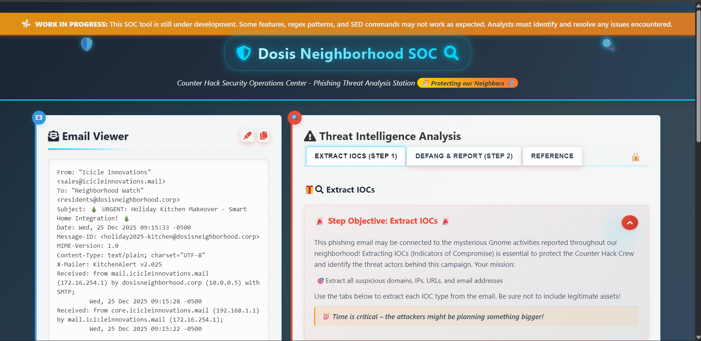

The phishing Email presented on the SOC station prompt users to update their kitchen setups by downloading a malicious file.

```email title="Email"
From: "Icicle Innovations" <sales@icicleinnovations.mail>
To: "Neighborhood Watch" <residents@dosisneighborhood.corp>
Subject: 🎄 URGENT: Holiday Kitchen Makeover - Smart Home Integration! 🎄
Date: Wed, 25 Dec 2025 09:15:33 -0500
Message-ID: <holiday2025-kitchen@dosisneighborhood.corp>
MIME-Version: 1.0
Content-Type: text/plain; charset="UTF-8"
X-Mailer: KitchenAlert v2.025
Received: from mail.icicleinnovations.mail (172.16.254.1) by dosisneighborhood.corp (10.0.0.5) with SMTP;
         Wed, 25 Dec 2025 09:15:28 -0500
Received: from core.icicleinnovations.mail (192.168.1.1) by mail.icicleinnovations.mail (172.16.254.1);
         Wed, 25 Dec 2025 09:15:22 -0500

Dear Valued Dosis Neighborhood Residents,

🚨 IMMEDIATE ACTION REQUIRED 🚨

Our elite team of Sunny's kitchen renovation specialists have detected some SERIOUSLY outdated kitchen setups in your neighborhood! It appears that certain homes are still using legacy appliances without proper smart home integration - like non-IoT fridges that can't automatically order milk, or microwaves that don't sync with your meal planning apps! 

While this sounds like a delightfully festive renovation opportunity (and totally not a security assessment), we need you to:

1) Download our FREE Kitchen Renovation Planner™ with built-in security features (totally legit, we promise!):
   https://icicleinnovations.mail/renovation-planner.exe
   
2) Upload high-resolution photos of your current kitchen to our secure design portal (we need to see ALL angles for proper renovation planning):
   https://icicleinnovations.mail/upload_photos

For instant help with any kitchen renovation questions, contact our 24/7 design hotline at 523.555.0100 or our renovation specialists at 523.555.0101.

Remember: If your old appliances start acting up during the assessment, it's probably just excitement about their upcoming upgrades! But please document any issues with photos.

Stay merry (and consider smart upgrades),
Icicle Innovations 
Chief Kitchen Design Specialist
📞 523.555.RENO
info@icicleinnovations.mail

P.S. - Has anyone else noticed their kitchen cabinets mysteriously rearranging themselves overnight? We can fix that with proper smart storage solutions!
```
### Detection

The first part of the report is to detect and extract IOCs such as Domains, Emails, IP addresses, and URLs using Regex.
### Domains
This regex code was used to extract the domains in the email.

```regex title="Domain Regex"

[a-zA-Z0-9-]+(\.[a-zA-Z0-9-]+)+

```

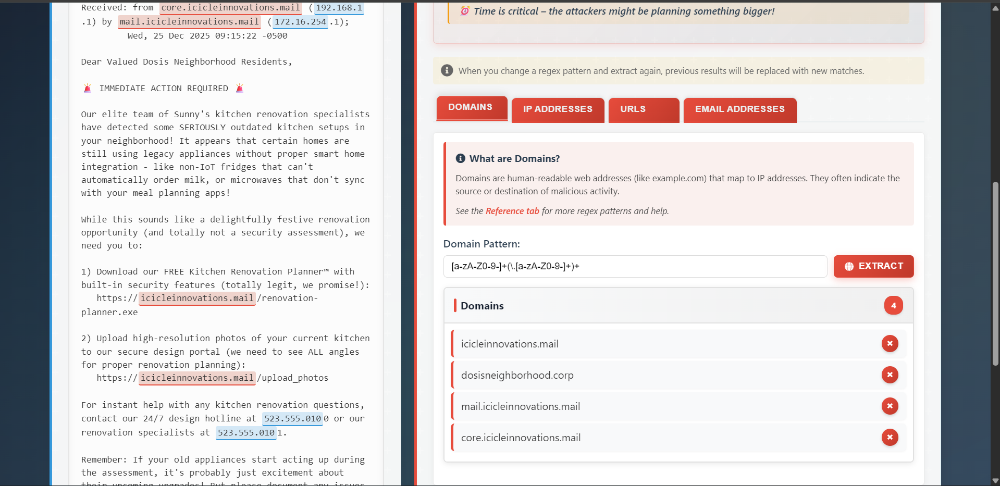

After extracting all domains, any domain that is not suspicious (the Neigborhood domain) can be excluded as IOCs.

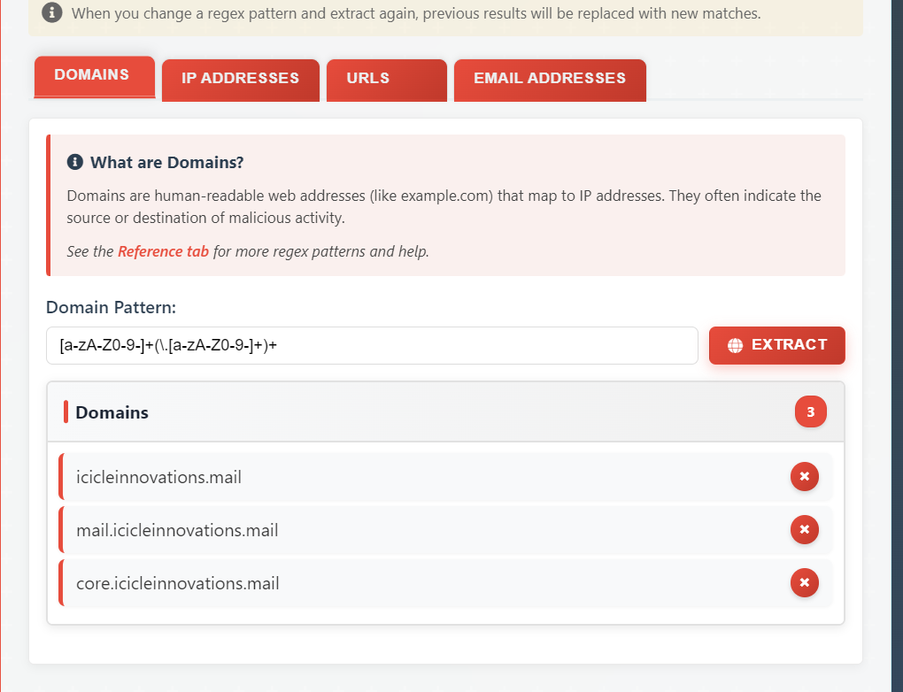

### IP Addresses

The email header gave IP addresses of the different servers involved in the email delivery. Since IP addresses are based on 4 octets sperated by dots (.) with the max value by octet being 255, this regex can be used to extract anything that looks like and IP address and filter the suspicious one.

```regex title="IP Regex"

\d{1,3}\.\d{1,3}\.\d{1,3}\.\d{1,3}

```
After running the regex, these IP addresses have been collected and non suspicious IPs like the neighborhood mail server IP have been exluded of the IOC list.
Note: this screenshot is from the initial regex return. the IP 10.0.0.5 was excluded as IOC.

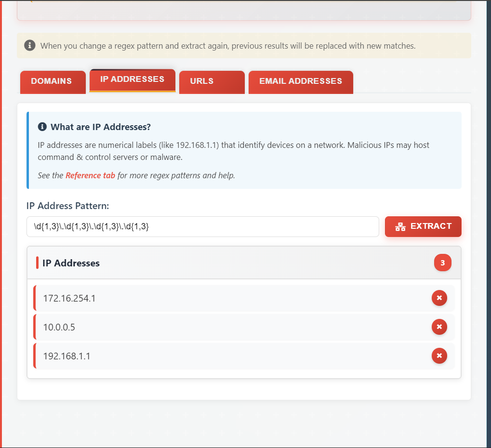

### URL extraction

The attacker asked the email recipients to download a software and upload pictures to another link. These URLs need to be extracted as IOCs.

This regex has been used to extract URL IOCs.

```regex title="URL Regex"

https://[a-zA-Z0-9-]+(\.[a-zA-Z0-9-]+)+(:[0-9]+)?(/[^\s]*)?

```
Two URLs have been extracted from the Email with this regex.


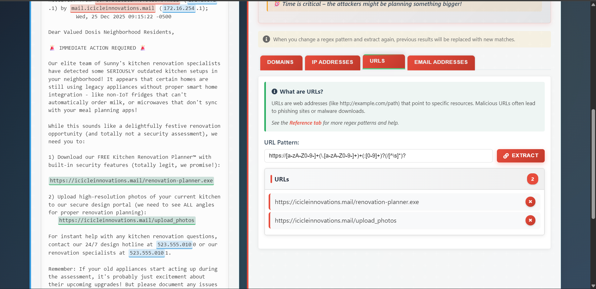

### Email extraction

This regex was used to extract email addresses from both the header and message body.

```regex title="Email Regex"

\b[a-zA-Z0-9_%+-]+@[a-zA-Z0-9.-]+\.[a-zA-Z]{2,}\b

```
After running it, four addresses were identified:
!!! info "Email extracted"
    - sales@icicleinnovations.mail
    - residents@dosisneighborhood.corp
    - holiday2025-kitchen@dosisneighborhood.corp (from the Message-ID field)
    - info@icicleinnovations.mail

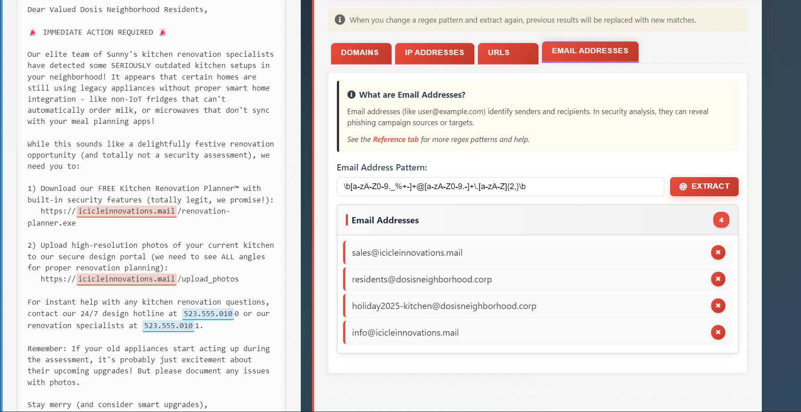

Following the same filtering logic used in the domain and IP sections, the internal dosisneighborhood.corp addresses were treated as non-malicious context and excluded from the IOC list.
The suspicious email IOCs retained for reporting were:

!!! danger "IOC Emails"
    - sales@icicleinnovations.mail
    - info@icicleinnovations.mail

### Defang and report
After extracting the suspicious IOCs, the next step is to defang them so they can be safely shared in reports, tickets, and threat intel channels without accidental clicks or execution.

The SOC station instructions required the following transformations:

!!! info "Defang rules used"
    - Replace dots `.` with `[.]`
    - Replace `@` with `[@]` in email addresses
    - Replace `://` with `[://]` in URLs
    - Replace `http` with `hxxp`

The custom SED chain below was used to apply those rules in one pass.
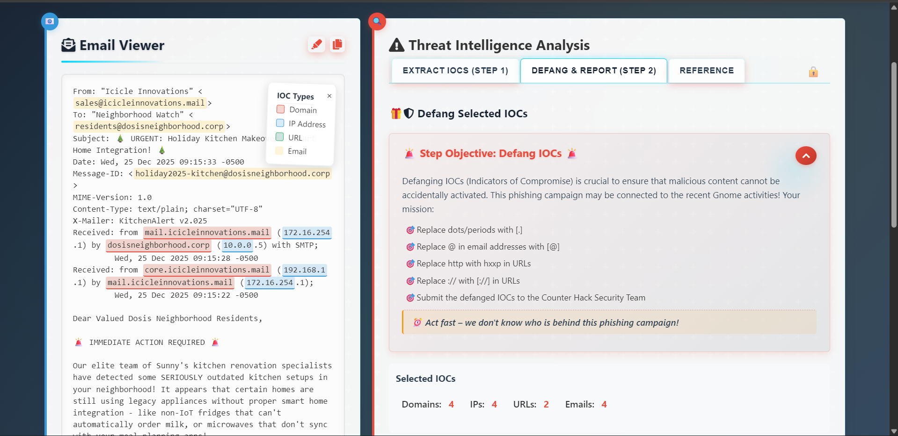

This SED command was used to defang the IOCs.

```regex title="SED command"

s/\./[.]/g; s/@/[@]/g; s/:\/\//[://]/g; s/http/hxxp/g

```

After applying the command, all selected domains, IPs, URLs, and email addresses were converted into safe, non-clickable IOC strings and submitted in the phishing IOC report.

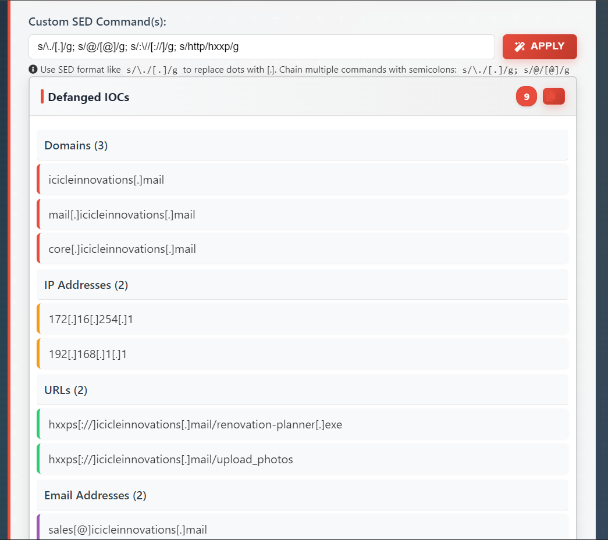

### Answer

After IOC extraction and defanging were completed, the phishing IOC report was successfully generated and marked as completed by the SOC workflow.

!!! success "Submitted result"
    - Defanged IOCs were submitted successfully
    - Report status: **COMPLETED**
    - Objective completed: **Its All About Defang**

The completion page confirms the phishing IOC report metadata and shows the overall status as **COMPLETED**.

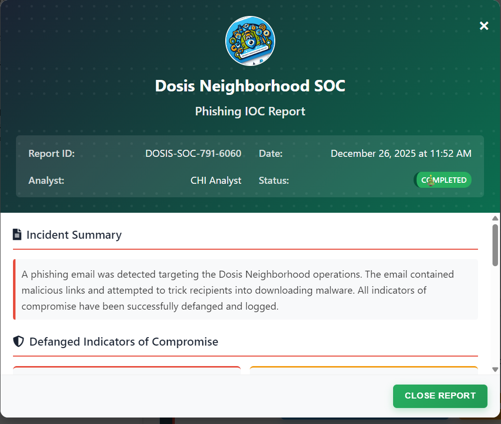

Under **Actions Taken** on the completion page a summary of the the actions taken was listed which includes defanging, threat intel updates, endpoint blocking, and email filter hardening.

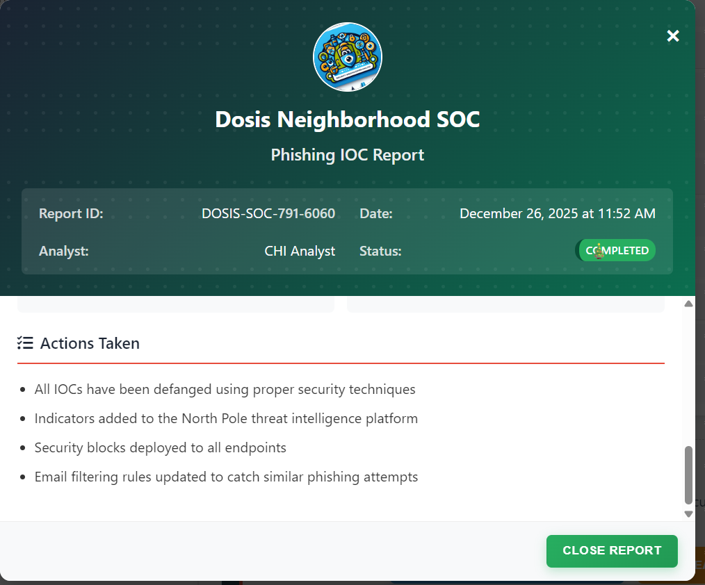

The objective tracker page in the Holiday Hack interface confirms that **Its All About Defang** is fully completed.

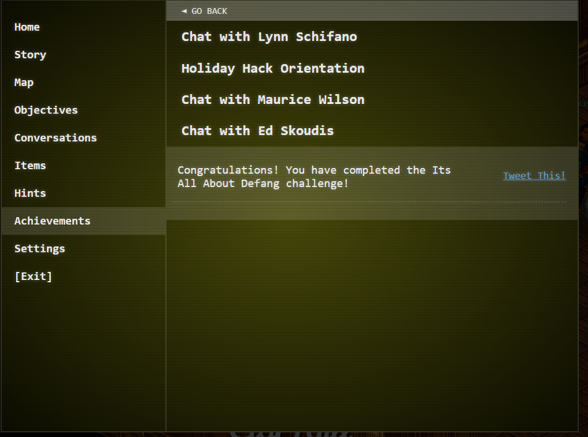

!!! success "Answer"
    The phishing IOC report was completed successfully after extracting and defanging all suspicious indicators.

## Response

!!! quote "Ed Skoudis"
    Well you just made that look like a piece of cake! Though I prefer cookies...I know where to find the best in town!

    Thanks again! See ya 'round!
