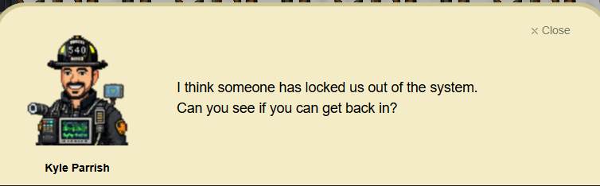
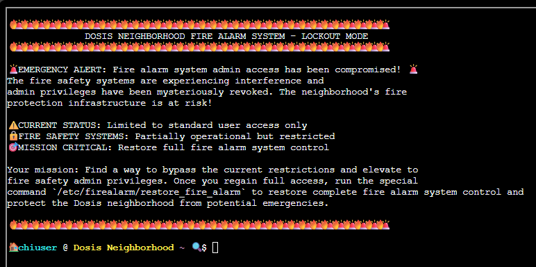
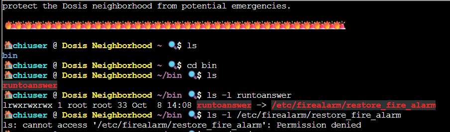
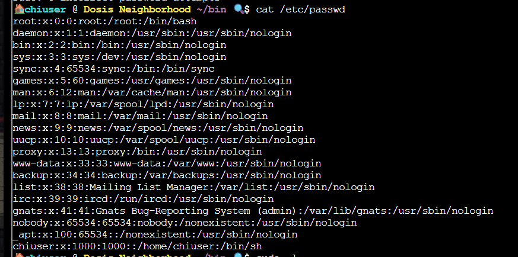
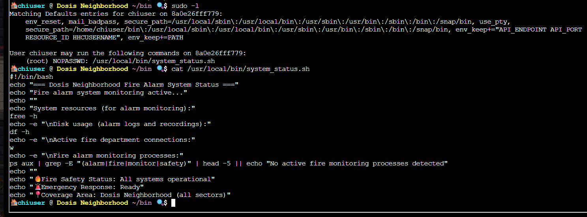
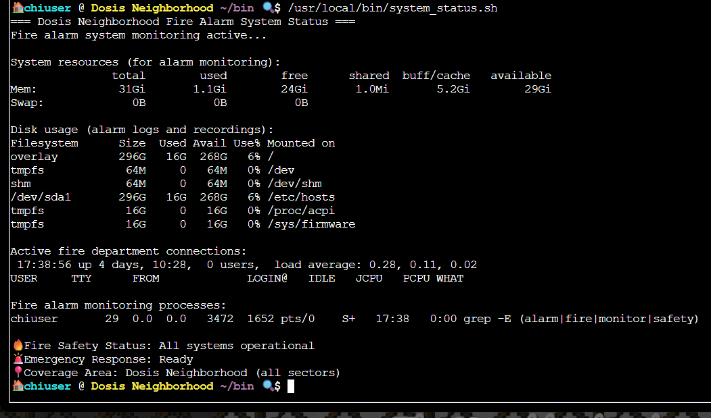
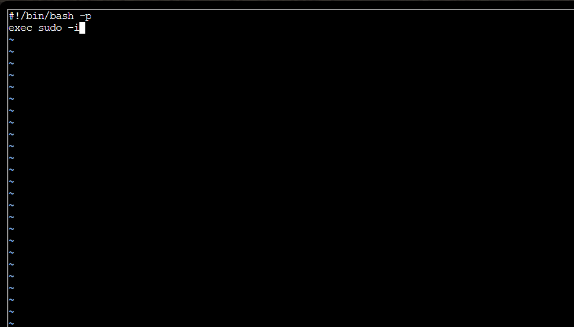
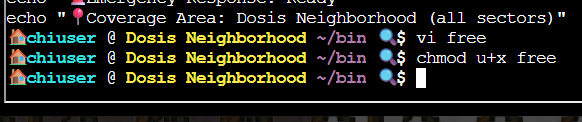
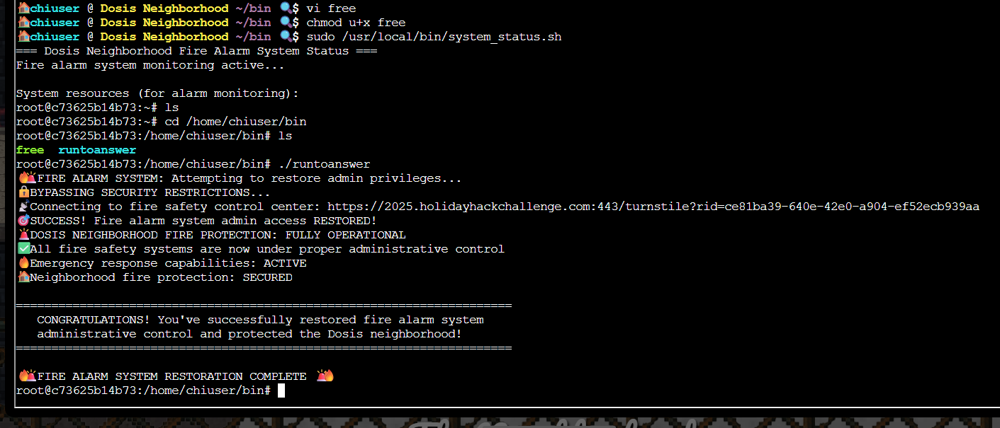
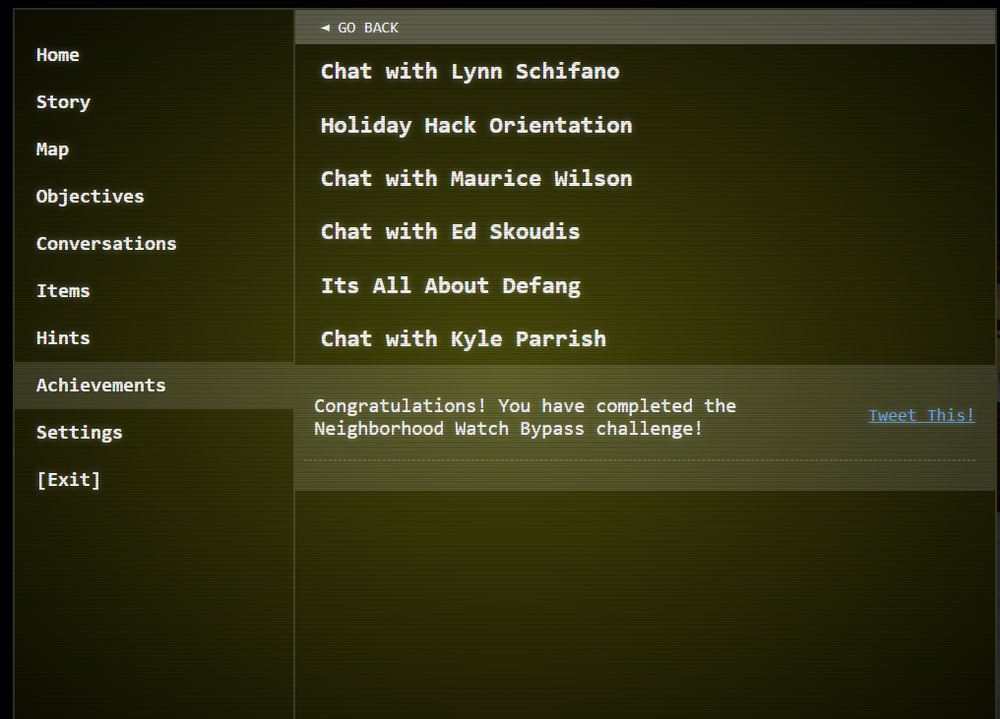

# Neighborhood Watch Bypass

**Difficulty**: :fontawesome-solid-star::fontawesome-regular-star::fontawesome-regular-star::fontawesome-regular-star::fontawesome-regular-star: 
**Direct link**: [Neighborhood Watch Bypass](https://2025.holidayhackchallenge.com/badge?section=objective&id=objDosisAlarm)

## Objective

!!! question "Request"
    Assist Kyle at the old data center with a fire alarm that just won't chill.

??? quote "Kyle Parrish"
    

<!-- ## Hints

??? tip "Insert Hint 1 Title"
    Along the way you will receive different hints. Insert them here.

??? tip "Insert Hint 2 Title"
    Along the way you will receive different hints. Insert them here. -->

## Solution

On opening the terminal, we are presented with a message that says the fire alarm system admin access is compromised and only standard user access is available.
The task is to bypass the current restrictions and elevate to the fire alarm system control. After achieving the privilege escalation, we should run the script at

~~~bash linenums="1" title="Fire alarm system restoration script"
/etc/firealarm/restore_fire_alarm
~~~

And the fire alarm system control will be restored completely.

### Enumeration

The first phase was focused on understanding the host context and checking for privilege escalation.

The home folder of the standard user contains the folder <code>bin</code> which contains the file <code>runtoanswer</code>. The file <code>runtoanswer</code> has a symbolic link to the file that should be run after the privilege escalation <code>/etc/firealarm/restore_fire_alarm</code>. The standard user does not have access to this file as even the <code>ls -l /etc/firealarm/restore_fire_alarm</code> command returned a <code>Permission denied</code>.

I checked the <code>/etc/passwd</code> to see if any other users exist. This was obviously a dead end since only the root account and the chiuser are login accounts. Additionally, the root account is protected by a password.

After some online search, I found that the command <code>sudo -l</code> can be used to list the sudo commands the current user is allowed to run.

The command <code>sudo -l</code> revealed that the current user can run the root script <code>/usr/local/bin/system_status</code> with no password.

A quick look at the <code>/usr/local/bin/system_status</code> file reveals that the script checks the Fire alarm system status, the system resources, disk usage, and running processes.

When the script is run, all the system status are shown. 

!!! warning "Key finding"
    Possible path hijacking using the <code>free</code> command called in the <code>/usr/local/bin/system_status</code> script

The <code>free</code> command discloses the amount of free and used memory in a system. Like many utilities, this command resides in the <code>/usr/bin</code> folder. 
When a command is called, the system looks for the command based on the PATH configuration. For the <code>free</code> command, the path search on a Debian-based system will be <code>PATH="$HOME/bin:/usr/local/bin:/usr/bin:/usr/bin:/sbin:/bin"</code>. Since the <code>/usr/local/bin/system_status</code> does not include the path to the <code>free</code> command, <code>~/bin/free</code> will run first if it exists. 

### Exploitation

After identifying that path hijacking is possible on this system, I created a bash script called free in the <code>~/bin/</code> directory.

The script contains these lines.

~~~bash linenums="2" title="free script"
#!/bin/bash -p
exec sudo -i
~~~

The <code>-p</code> option here helps to preserve the elevated privilege when <code>sudo /usr/local/bin/system_status</code> is run. The <code>exec sudo -i</code> enables an interactive root shell.

<!--  -->
<!--  -->

Execution permission was given to the current user on the <code>~/bin/free</code> script.

After running the <code>~/bin/free</code> script, I got root access and was able to run the <code>/home/chiuser/bin/runtoanswer</code> script, which has a symbolic link to the script <code>/usr/local/bin/system_status</code>. This restored the fire alarm system administrative control.

### Validation and Completion

The objective was added to the achievements list.  

## Response

!!! quote "Kyle Parrish"
    Wow! Thank you so much! I didn't realize sudo was so powerful. Especially when misconfigured. Who knew a simple privilege escalation could unlock the whole fire safety system?
